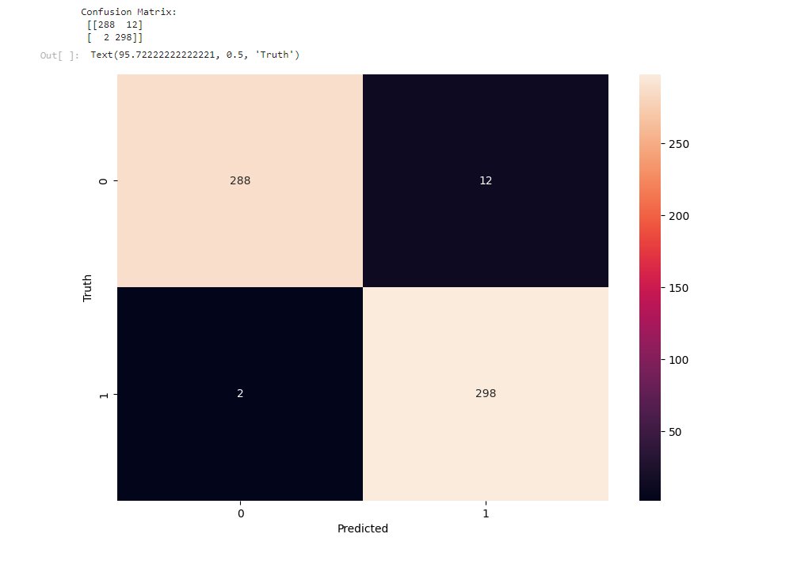
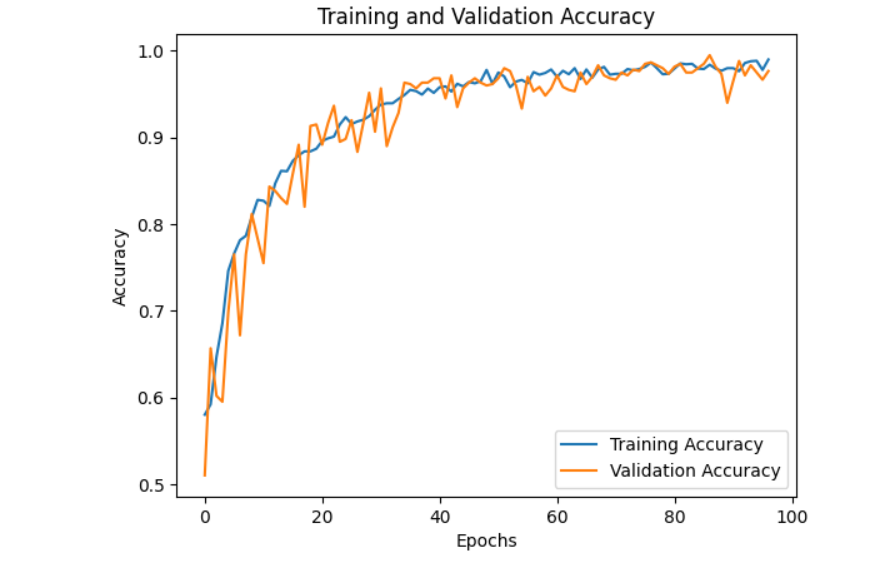
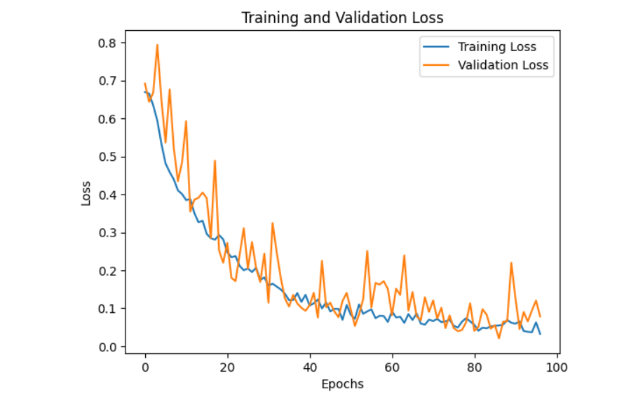

# 🧠 Brain Tumor Classification Using CNN

This project focuses on the development of a **brain tumor classification model** using **Convolutional Neural Networks (CNNs)**. It leverages MRI images to differentiate between patients with brain tumors and those without, achieving impressive results in terms of accuracy and reliability.

## 🌟 Project Highlights

- **Dataset**: 2,600 MRI images (1,300 labeled as tumor, 1,300 labeled as non-tumor).
- **Model**: Convolutional Neural Network (CNN) architecture with data augmentation.
- **Performance**: Achieved **98% accuracy** with near-perfect **precision** and **recall** scores.
- **Real-World Application**: Aiding medical professionals with early detection and accurate classification of brain tumors, potentially reducing the burden on radiologists and improving patient outcomes.

---

## 🏥 Impact of the Project

Early detection of brain tumors is critical for effective treatment, and this model has the potential to assist healthcare professionals by providing fast, accurate diagnoses. The model not only reduces diagnostic errors but also accelerates the review process in high-demand medical environments.

---

## 📊 Model Performance Overview

## Confusion Matrix

The confusion matrix shows how well the model distinguishes between MRI scans with tumors and those without:



- **True Positives**: 298 (correctly classified tumor cases)
- **True Negatives**: 288 (correctly classified non-tumor cases)
- **False Positives**: 12 (non-tumor classified as tumor)
- **False Negatives**: 2 (tumor classified as non-tumor)

---

## Training and Validation Accuracy

The accuracy of the model increased consistently throughout training, reaching optimal performance after 100 epochs:



---

## Training and Validation Loss

The loss graph shows that both training and validation loss decreased steadily as the model learned, indicating successful convergence:



---

## 🧪 Detailed Classification Report

```plaintext
               precision    recall    f1-score    support

No Tumor          0.99       0.96       0.98       300
Tumor             0.96       0.99       0.98       300

accuracy                                0.98       600
macro avg         0.98       0.98       0.98       600
weighted avg      0.98       0.98       0.98       600
```


## 🔗 **Connect with Me**

If you're passionate about AI and its real-world applications, feel free to connect with me:

 [](https://www.linkedin.com/in/gohil-jayrajsinh/)


Let’s push the boundaries of technology and make an impact! 🚀


## 🙏 **Thank You**

Thank you for taking the time to explore this project!  
I truly appreciate your interest, and I hope this project inspires you to explore the exciting world of AI and Machine Learning. 

Feel free to reach out if you have any questions, feedback, or suggestions. Let’s learn and grow together!

---